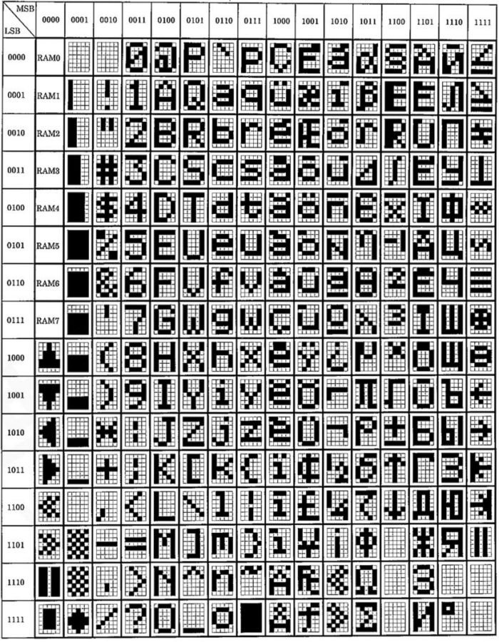

# Characters

## How to Use Futaba's Inbuilt Characters



Notice in this chart (from the [8-MD-06INKM specification PDF](specifications/8_MD_06INKM_VFD_SPECIFICATION.pdf)) that most characters in the 7-bit range match usual ASCII numbers.  After that, they do not... but they are available if you send the correct byte to the display.

In your ESPHome you can still use those characters as normal if you include a line something like this:

```
  replace: "°:0b11101111,Ä:142;ä:132;Ö:153;ö:148;Ü:154,ü:0x81;п:0b11100010"
```

This will allow you to use standard Unicode to send any character included on this table to the clock and the clock will be able to display it.  
I've included the ability to use whichever numbering scheme you prefer.  Decimal will be assumed so please check carefully and use standard
number prefixes if using hex (0x) or binary (0b).  If you see something weird, you probably forgot the prefix!

It also should work for other compatible displays, provided you specify the right replacement byte.
Every Futaba VFD display uses a different set of characters.

But, there are more than a few characters missing. Of course there are.  The display is limited to 8-bit bytes.

## How to Create Custom Characters

Futaba VFDs all seem to reserve the first 8 bits to allow customized characters to be displayed. But first they need to be loaded into one of 8 CGRAM slots.
My driver will allow those slots to be used dynamically, depending on what character you would like to display.
You are NOT limited to 8 characters total (but the display is limited to 8 characters, so hopefully no problem).

The customized characters must be first drawn using bits, which will form 7-bit bytes (at least on the 8-MD-06INKM).

Here is a basic represention of the Korean Hangul character "il" in an 5x7 grid:


But the display uses columns and starts from the left-bottom column, so let's rotate it 90-degrees clockwise and count bits:


So the first byte in binary is `0010010` and the second is `0010101` and the third, `1110010` and so on.
You can download a [5x7 grid image](./images/grid-5x7.png) if you like.
You can convert the binary to decimal or hex if you like.  Decimal will be assumed so please check carefully and use standard
number prefixes if using hex (0x) or binary (0b).  If you see something weird, you probably forgot the prefix!

Here and in the YAML are examples to use the Bitcoin symbol and certain Korean Hangul characters:
```
custom: "₿:62,107,42,107,20;금:117,85,85,85,119;목:55,53,61,53,119;수:20,18,113,18,20;오:34,37,61,37,34;요:34,61,37,61,34;월:38,45,102,72,95;일:18,21,114,64,71;전:121,71,89,68,95;토:95,85,117,85,81;화:22,123,22,127,8;후:38,42,107,42,38"
```

Here is the original binary (quite a bit longer!):
```
custom: "₿:0b0111110,0b1101011,0b0101010,0b1101011,0b0010100;금:0b1110101,0b1010101,0b1010101,0b1010101,0b1110111;목:0b0110111,0b0110101,0b0111101,0b0110101,0b1110111;수:0b0010100,0b0010010,0b1110001,0b0010010,0b0010100;오:0b0100010,0b0100101,0b0111101,0b0100101,0b0100010;요:0b0100010,0b0111101,0b0100101,0b0111101,0b0100010;월:0b0100110,0b0101101,0b1100110,0b1001000,0b1011111;일:0b0010010,0b0010101,0b1110010,0b1000000,0b1000111;전:0b1111001,0b1000111,0b1011001,0b1000100,0b1011111;토:0b1011111,0b1010101,0b1110101,0b1010101,0b1010001;화:0b0010110,0b1111011,0b0010110,0b1111111,0b0001000;후:0b0100110,0b0101010,0b1101011,0b0101010,0b0100110"
```

Since the syntax of this uses a colon, you can replace the colon itself by simply not specifying a character to replace:
```
custom: ":0,54,54,0,0"
```
This example will make a thicker colon like the product picture.

## Notes about Characters

The replacements and custom characters are searched in that order.  If you have already specified a replacement character, the custom characters will not be searched. After replacements and custom characters have been applied, the driver will check if it is an 8-bit character. If not, the character will be discarded and not displayed.  Many Unicode characters use 2 or 3 or 4 bytes so misprinting could have some pretty unpredictable results.

That said, printing a standard 8-bit character (without having specified replacements) could also have weird results.  If you send `ý` (Unicode character 253) to the display, the 8-MD-06INK will display the character `‖`.  Other displays have different character tables so you should be aware of this when using anything that isn't in the 7-bit ASCII range.

Keep in mind that if trying to display something that uses more than 8 custom characters, only the first 8 will be displayed.  The rest - if above ASCII range - will be discarded.

### A Warning About Memory Limits

Although I have used Korean on my clock, this is a fairly limited character set. Replacing characters using either method requires in-memory lookup tables (TWO!)
that are checked for each and every character to be printed to the display. The VFD Clock runs on an ESP-12. It's not exactly top-of-the-line.
Add a few characters at a time and be sure that your clock isn't significantly slowing down, especially if you are display seconds.
I have not tested it with more than 30 characters total.

### Mass Conversion of Numbers / A Warning About ChatGPT

I tried using ChatGPT to convert the Korean binary codes to decimal to save space in my YAML. It made mistakes. Seriously...?

If you have many binary numbers to convert try: https://www.convzone.com/binary-to-decimal/

This one is also useful: https://www.mathsisfun.com/binary-decimal-hexadecimal-converter.html

## Character Tables

Here are some animated tables from the specification, overlaid with decimals to make finding your replacement character easier.

To prepare the GIF, I used a [PPTX](./images/Make_Decimal_GIF.pptx) printed with [PDFill](https://www.pdfill.com/)
and then animated with [Ezgif](https://ezgif.com/).

Keep in mind that every model of display will have different tables.

### 8-MD-06INKM


## Custom Characters

Check the [language filters](./language_filters/) folder if looking for specific languages.

### Punctuation

Fat colon:`:0,54,54,0,0`

### Currency

```
₿:62,107,42,107,20;₩:63,100,60,100,63;
```

