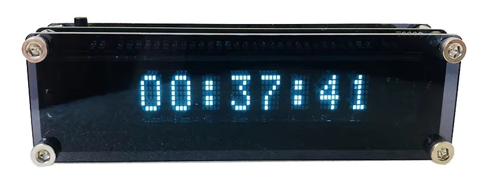
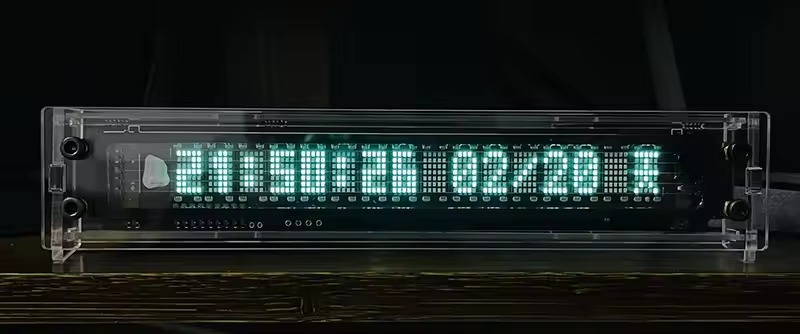
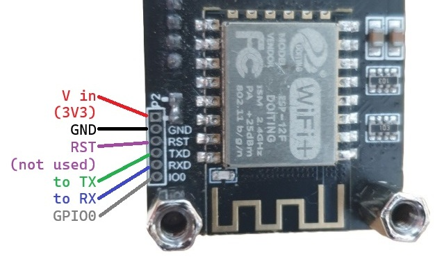
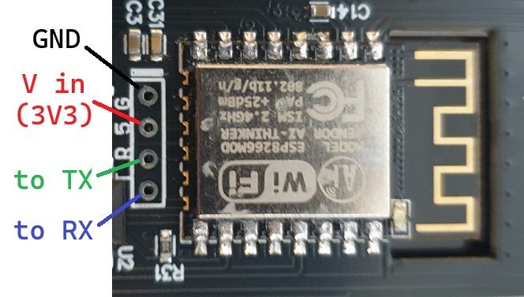
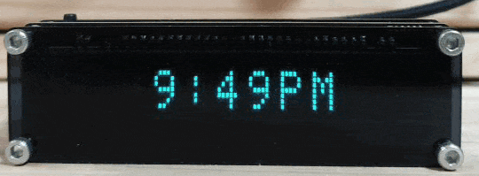
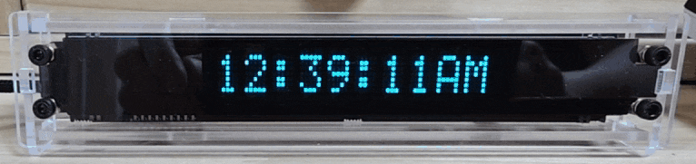
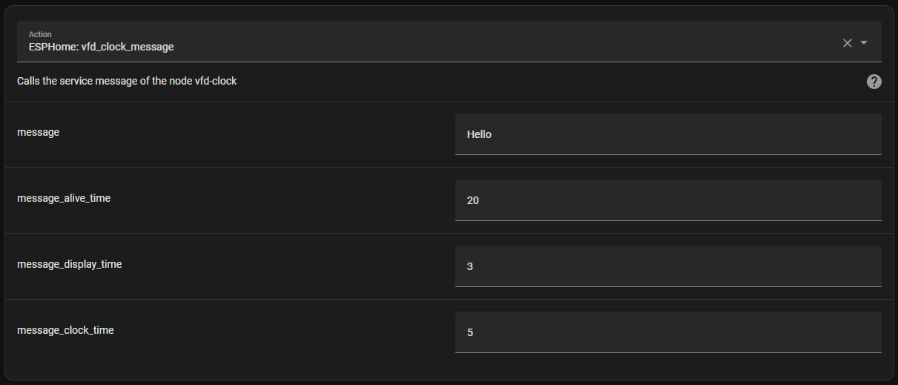
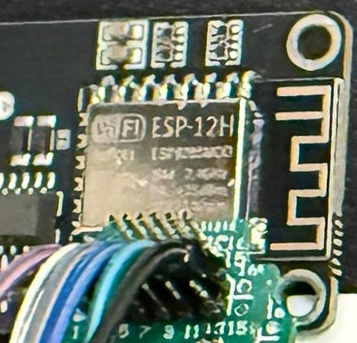

# EspHome-VFD-Clock

***This documentation is the same on the [Github Page](https://trip5.github.io/EspHome-VFD-Clock/), which may be easier to read.***

EHVC is meant to be used on ESP-based VFD (Vacuum Fluorescent Display) Clocks using ESPHome.
So far, it works with the appropriately named VFD Clock and the LGL Studio V16
but it can probably be adapted for use with other SPI character-display VFD clocks.
And, of course, it's ESPHome, so it's only limited by your imagination and skill.

A lot of inspiration is taken from the [`EHMTXv2`](https://github.com/lubeda/EspHoMaTriXv2) project... but with a VFD display.

Using a VFD in ESPHome requires the display to be supported by an external component. 
The one included in this repository is originally meant for the 8-MD-06INKM as used in the VFD Clock.
It definitely supports other VFD displays that use the Hitachi HD44780U interface, including the unknown Samsung VFD as used in the LGL Studio V16.

Skip down to the [Custom Component Driver](#custom-component-driver) section below if you're just here for the VFD drivers.

Due to memory constraints on the ESP8266 these clocks use, I've decided to split the functions by how you may choose to use the clock.  Read below for more details.

---

## VFD clocks

### 8-Character VFD Clock



Here is a link on Aliexpress I have personally used but I am sure there are others:
https://www.aliexpress.com/item/1005005899159729.html

### 16-Character LGL Studio V16



Here is a link on Aliexpress that I have personally used:
https://www.aliexpress.com/item/1005004267634532.html

As well as a link for the original maker:
https://lglstudio.com/products/lgl-vck-cccp-v16

### Flashing

You can use ESPHome to make it completely custom or you can use my [Web Tool](https://trip5.github.io/EspHome-VFD-Clock/firmware.html).

#### 8-Character VFD Clock

Don't forget to connect GPIO0 to GND when first connecting to your serial flasher!  You can also hold the button while powering-on.



A JST1.25mm header should fit nicely if you want a DIY quick-connector... or you can use sewing needles.


#### 16-Character LGL Studio V16

GPIO0 is not exposed here but it is connected to the ▲ button so hold this button while powering-on.



2.54mm pin headers fit nicely (duPont male connectors will kind of work).

<!--

---

## New to ESPHome?

Try following this step-by-step guide to compiling a YAML:
[Beginner's Guide to Adding Devices](https://deploy-preview-4411--esphome.netlify.app/guides/beginners_guide_adding_devices)

This guide is proposed for the ESPHome documentation and if you find it helpful, it would be great if you could leave a comment in the
[Pull Request](https://github.com/esphome/esphome-docs/pull/4411) to get them added to the ESPHome Docs officially.

-->

### New to Flashing a Device?

You can read this: [Physically Connecting to your Device](https://esphome.io/guides/physical_device_connection) but with this device, you can use it's inbuilt USB port.

---

## Using This firmware

This is ESPHome, so it's not pretty but very functional.  You should set your wifi information in the YAML and edit it carefully.

If using this device on a network outside your usual, ESPHome will, after 10 seconds (set by the YAML), give up trying to connect to its "home" network and enter AP mode.
You should then connect to the hotspot (with a mobile phone) and then go to 192.168.4.1 in a browser to select which local wifi network you would like it to connect to.
The clock will display its IP address on boot and also by holding down the set button for more than 1 second. When returning home, you will have to go through this process again.
Be sure if you are using this clock as a travel clock to NOT use Home Assistant as a time source (the non-HA version uses SNTP by default).

There does appear to be some errors with "Component preferences took a long time for an operation" but it only happens when saving persistent variables to flash and doesn't seem to affect functionality, unless you try to change a variable during this moment.

### Home Assistant

Both versions of the YAML files will connect to the Home Assistant API if available.  Both can be controlled via device integration in HA.

The Non-HA version will function completely without Home Assistant and can still be controlled by accessing the WebUI via its IP or mDNS address.

### Button Functions

Of course, this is ESPHome, so you can change the button functions by editing the YAML if you wish.

#### 8-Character VFD Clock

There's only one useable button on this clock but thanks to multi-click, we can use it for a few functions.

| Download Button      | Functionality                   | HA Version        |
| -------------------- | ------------------------------- | ------------------|
| Short-click          | Toggle date display mode on/off | Same              |
| Double-click         | Toggle 12/24-hour mode on/off   | Same              |
| Short-click, long-press | Toggle Time Zone Offset on/off | Toggle Alt Time Zone |
| Long-press 2 seconds  | Show the clock's IP address (or other wifi status) | Toggle Time/Date Text Replacement |
| Long-press 5 seconds | Toggle the Wifi Stop Seek on/off (see below) | Toggle Auto Replacement = Alt. Time |

#### 16-Character LGL Studio V16

Three buttons on this clock and multi-click make this clock easy to use multiple functions.
Unfortunately, the ■ button is connected to GPIO2 which is used by the onboard LED which is needed in various other routines of the clock,
but two buttons are still very good.

| Button                  | Functionality                   | HA Version        |
| ----------------------- | ------------------------------- | ------------------|
| ■ Unusable              | None                            | None              |
| ▲ Short-click           | Toggle date display mode on/off | Same              |
| ▲ Double-click          | Toggle 12/24-hour mode on/off   | Same              |
| ⬤ Short-click          | Toggle Time Zone Offset on/off  | Toggle Alt Time Zone |
| ⬤ Double-click         | Show the clock's IP address (or other wifi status) | Toggle Time/Date Text Replacement |
| ⬤ Long-press 2 seconds  | Toggle the Wifi Stop Seek on/off (see below) | Toggle Auto Replacement = Alt. Time |

### Date Display

The clock can display the date at configurable intervals.
The display interval checks how long the clock was displayed for and then displays the date for the specified time (in seconds).
Keep in mind that displaying the message from the Home Assistant integration will not interrupt this count, so I recommend choosing sane and even numbers.

### Time/Date Text Replacement

Since ESPHome can't seem to use any locale for time other than English, I have added an option to substitute the time and date text to something else.
In the text_sensors section, you can find filters that allow substitutions.

In my YAML, you will see those filters are able to localize time into Korean Hangul.  You can change this to anything you like.
Be sure that the text to be substituted matches the output of strftime (which will be the default) and be sure to make sure any characters you need
are included in the glyphs section or those special characters will not be displayed!

There is also an option called Replacement Interval by which you can make your clock bilingual.
It will automatically turn on/off the substitution every number of times the date is displayed, if the date is displayed.
If the date display is off, the automatic replacement will be made after the time specified by Date Display Time (multiplied by the Date Display Interval).

#### 8-Character Clock



Check the [language filters](./language_filters/) folder for some examples.  So far there is:
[`Korean`](language_filters/Korean.yaml) &
[`French`](language_filters/French.yaml) &
[`Greek`](language_filters/Greek.yaml) &
[`Chinese`](language_filters/Chinese.yaml)

#### 16-Character Clock



Check the [language filters](./language_filters/) folder for some examples.  So far there is:
[`Korean`](language_filters/Korean_16.yaml) &
[`French`](language_filters/French_16.yaml) &
[`Greek`](language_filters/Greek_16.yaml) &
[`Chinese`](language_filters/Chinese_16.yaml)

Please note that because this clock does not use fonts, you may have to design your own.
The function to create your own characters is part of the VFD custom component.
Read more in the [Custom Component Driver](#custom-component-driver) section.

### Time Sync

Time can be synced to the Internet at configurable intervals between 1 - 24 hours, provided the wifi network is connected.

---

## Non-HA Version

The file [`EHVClock.yaml`](EHVClock.yaml) contains functions useful for using the VFD Clock as... mostly just a clock but with some power-saving functions.
It includes all of the functions above as well as these below.  This version has a WebUI which can be accessed via it's IP after connecting the clock to Wifi.
So if you need a travel clock, this may be the ideal one for you.  It can still be controlled by Home Assistant as well but is not dependent on it to function.

The file [`EHVClock_LGLV16.yaml`](EHVClock_LGLV16.yaml) is derived from the above master file for the LGL Studio V16 Clock.

Please note that unlike LED-based clocks, a VFD uses a significant amount of power, so it would be very unwise to run this clock from a battery
with the display always-on.  Take a look at power consumption in the [Power Consumption](#power-consumption) section below.

### Time Zone Offset

It's up to you how to handle time offset.
You can set an offset with a number that is a positive or negative value with decimal places (ie. 2, -2, 12.5).

I have allowed steps of 0.25 (equal to 15 minutes) but ESPHome does not enforce those steps.
It is possible to set an offset like 0.01 (which would be 36 seconds).  Be careful.

### Time Zone POSIX

Thanks to [andrewjswan](https://github.com/andrewjswan) for the idea to make the time zone editable directly in the WebUI.
It must be in POSIX format (see [notes](#posix-time-strings) below).  Don't forget to hit enter to make it stick.

### Wifi Stop Seek

This is disabled by default but by turning it on, the clock will disable its wifi radio after a configurable time if the network connection is dropped.
Note that this does not turn wifi off if connected, it's merely a timeout for when the configured wifi connection cannot be made. 
This is meant as a power-saving feature in the event of a power blackout.

Under normal conditions, when an ESPHome device loses wifi connectivity, it will continuously seek out a wifi connection or activate a hotspot to allow configuring a wifi connection.
While in this non-connected state, the clock will use more power than usual. If you have a coin-cell battery that maintains the RTC during a blackout,
you could re-connect the clock to a powerbank or some other power source and it will continue to function.

Please note that this also means that the clock will not try to connect to wifi again (this will be indicated on the screen as "Wifi Off" when long-pressing the button),
unless you reset the power, which just means unplugging it and plugging it back in again.

Do not set this time too short.  I have allowed 60 seconds minimum in the options but this could mean your clock stops trying to connect to wifi just because
your router rebooted or the wifi was a bit sketchy. The default is 120 seconds which I think is enough time for even the slowest router to reboot, but it's your choice.
Also keep in mind that this time will affect how long the configuration hotspot is available for.
The hotspot will activate after 10 seconds (lowered from 60 seconds which is ESPHome default) but will be deactivated when the Wifi Stop Seek Time has elapsed.

You can enable or disable this mode by holding the button for 5 seconds to toggle the function. The wifi will be turned on again if it has been turned off.

### Display Off

There are two options to turn off the display. One is to turn off the display after a configurable time when the clock is not being used (in minutes).
The other is to turn off the display when there is no Wifi connection (in seconds).  The display may be turned on again by pressing the button.

### Power Consumption

*8-Character VFD Clock, 2024.11.11 Version, 1 hour each mode, measured with a FNIRSI FNB-58 powered externally*

| Status: Modes                                        | Power usage |
| ---------------------------------------------------- | ----------- |
| Connected: Display On - Brightness 200               | 234.65 mAh  |
| Connected: Display On - Brightness 30                | 204.46 mAh  |
| Connected: Display Off after 5 min                   | 196.55 mAh  |
| No Wifi: Stop Seek Off & Display On - Brightness 30  | 205.12 mAh  |
| No Wifi: Stop Seek On & Display On - Brightness 30   | 154.76 mAh  |
| No Wifi: Stop Seek On & Display Off after 30 sec     | 142.86 mAh  |

#### What Does This Mean?

On maximum power savings, you could power the 8-Character clock from a 5000mAh powerbank for a day and a bit: `5000mAh / 143mA ≈ 34.9 hours`...

Vacuum Fluorescent Displays are **NOT** power-efficient.  If you would like a clock that consumes less power, I'd recommend something that uses an LED Display like [EspHome-Led-Clock](https://github.com/trip5/EspHome-Led-Clock) or [EspHome-Led-PixelClock](https://github.com/trip5/EspHome-Led-PixelClock).

### LED Output

While the clock is attempting to connect to wifi or while in hotspot mode, the blue LED will pulse on or off every 1 second.

If Stop Seek is enabled, then the LED will pulse on or off every 2 seconds during connection attempts instead.

If connected to Wifi or Stop Seek has activated, the LED will turn off completely.

### Special Note Regarding the WebUI's Internet Dependence

ESPHome devices usually rely on the Internet to be available to access a Javascript file that formats the web UI.
Specifically, the device will look for https://oi.esphome.io/v2/www.js but this file can be made available on-device with this included in the `webserver:` section.
This is added to the non-HA version by default.

```
  local: true
```
If you don't mind the device's WebUI being dependent on the Internet, you could remove this line.
You could consider hosting the file on another machine in-house, too by using something like:
```
  js_include: ""
  js_url: "http://192.168.1.1/esphome-www/www.js"
```

---

## Home Assistant Version

The file [`EHVClock-HA.yaml`](EHVClock-HA.yaml) contains functions useful for using the clock with Home Assistant.
It does not include the WebUI, Time Zone Offset, Time Zone POSIX, or Wifi Stop Seek but it does includes all of the functions below.

The file [`EHVClock_LGLV16-HA.yaml`](EHVClock_LGLV16-HA.yaml) is derived from the above master file for the LGL Studio V16 Clock.

### Alternate Time Zone

This option is to allow displaying a Time Zone other than your "home" time zone.  It can be activated permanently.

### Override Time Zones

Making Home Assistant Helpers (Input Text) with these names can override the in-firmware time zones.
Add `Clock Time Zone` and `Clock Time Zone Alt` as text helpers through [Helpers](https://my.home-assistant.io/redirect/helpers/).
By default, these entities are `input_text.clock_time_zone` and `input_text.clock_time_zone_alt`.

### Service Calls



This example will send a message that will display for 3 seconds before reverting to the clock for 5 seconds, and repeat until 20 seconds is finished
(if it is displaying the message, it will finish that last 3 seconds).
Unfortunately you are limited to what the display can actually display so you should probably test it out before adding it to an automation.
This is related to the [Custom Component Driver](#custom-component-driver).

### Template Sensors

This will allow the clock to display information screens, following a single interval of clock and date screens.  You can display all screens at once or one per interval.
They are all treated as sensors, similarly as my [ESPHome-eInk-Boards](https://github.com/trip5/ESPHome-eInk-Boards) projects.

Put something like this in your `configuration.yaml`:

```
template: !include template.yaml
```

Anything in `configuration.yaml` under the `template:` heading must now be moved to `template.yaml`. Take a quick look [here](https://community.home-assistant.io/t/how-do-i-setup-template-trigger-sensor-in-a-splitting-config/718626/) for some examples on an easy way to format `template.yaml`.

The file [`template.yaml`](template.yaml) contains several examples how to add sensors that can be automatically shown by the clock.
I personally use only one sensor in my Home Assistant and 2 clocks in the house get data from the same sensor but you can (of course) create a sensor for each  individual clock.

---

## Notes

### POSIX Time Strings

Please note that the time zones MUST be in POSIX format instead of the usual Olsen type (`Asia/Seoul`).

POSIX formats look like: `KST-9` or `PST8PDT,M3.2.0/2:00:00,M11.1.0/2:00:00` or `AST4ADT,M3.2.0,M11.1.0`.

They include daylight savings and time-switches in the formatting. So, there is no reliance on the ESPHome Olsen database to be current.
You can view all of the time zones in the world in POSIX format [`here`](https://github.com/trip5/timezones.json/blob/master/timezones.md).
If you need to make a custom POSIX format you can look [`here`](https://developer.ibm.com/articles/au-aix-posix/) or even better, use this
[`POSIX Generator`](https://www.topyuan.top/posix) courtesy of TopYuan.

### OTA Update Can Be Buggy

Because these devices save preferences to flash, updates that introduce new features (which I do often) may fragment the storage space, causing strange behavior.
It's always best to fully erase and re-flash when upgrading the version of the firmware.

### Flash Size of 8-Character Clock

It has come to my attention that certain clocks have what could be a fake ESP-12H stamp on the back.  My clocks all have an ESP-12F (an "upgraded" version of the ESP-12E) with 4M of flash memory. An ESP-12H should have 2M of flash but these only have 1M of flash memory! They look like this:



I'm told that physically flashing the ESP works but the clock does not retain settings and cannot be OTA updated.  Change your board section to this:

```
esp8266:
  board: esp07
  restore_from_flash: True
```

Please note that to be 100% certain of this, you may need to use [esptool](https://www.flamingo-tech.nl/2021/03/21/installing-and-using-esptools/) to determine for certain with this command:

```
esptool.py -p PORT flash_id
```

It may also be necessary to erase the flash before re-flashing (this can fix many problems):

```
esptool.py -p PORT erase_flash
```

### Speaker on LGL Studio V16

There is a speaker on GPIO12.  Alarms may be implemented in a future update.

---

## Custom Component Driver

### VFD / 8-MD-06INKM / HD44780

I could not find any custom component to support the Futaba 8-MD-06INKM Display that is part of the VFD Clock.  I found more than a few Micropython and
Arduino drivers including [sfxfs's driver](https://github.com/sfxfs/ESP32-VFD-8DM-Arduino/) which formed the foundation of the lower functions of my driver
I also had to look at the official drivers for [Max7219](https://esphome.io/api/max7219_8cpp_source) and [Max7219Digit](https://esphome.io/api/max7219digit_8cpp_source)
because this clock includes both inbuilt fonts and the ability to use the dot-matrix.

This driver supports more than just VFDs than the 8-MD-06INKM, but certain parts may need updating to function correctly.
The reason it can be used for other displays is because most VFDs adhere to the Hitachi HD44780 standard (except for higher-byte characters),
including the 16-character Samsung (model unknown) used in the LGL Studio V16. 

Please note also some of the sections of this driver are untested.
For example, the 8-MD-06INKM display has a reset pin and I'm not entirely certain what it actually does, despite being in the code.
The connection exists as a solder point on the VFD Clock but it is open.
I'm guessing the pin is pulled high to achieve its function (perhaps clearing custom characters in the CGRAM and/or blanking the display).

The ability to use an EN pin has also been put into the driver code as well.  This GPIO is assumed to be high to power the display.
Again, this function is untested.

### Characters

[Click here](Characters.md) to read the notes on characters. Even if you only use English, you may need some special characters.

Please note that non-Unicode characters are dropped by default. If you experience any weird characters displayed, then it is imperative to read the notes.

### How to Use the Driver


```yaml
external_components:
  - source:
      type: git
      url: https://github.com/trip5/EspHome-VFD-Clock
      ref: main
    refresh: 60s
    components: [ vfd ]

spi:
  clk_pin: GPIO12
  mosi_pin: GPIO14

display:
  - platform: vfd
    id: vf_display
    cs_pin: GPIO13
    update_interval: 1s # optional (ESPHome default: 1s)
    reset_pin: GPIO15 # optional, attached to reset pin of display (default: unused)
    en_pin: GPIO10 # optional, provides power to display (default: unused)
    intensity: 200 # optional, initial brightness 0 to 255 (default: 200)
    digits: 8 # optional, can be 6, 8 or 16 (default: 8) (6 has not be tested)
    scroll_delay: "500, 500" # optional initial & subsequent delays when scrolling (in milliseconds) (default: 1500, 500) (first text = both numbers combined)
    remove_spaces: "true" # optional, remove leading or trailing spaces (default: false)
    # Replace characters: Unicode character:Fubata byte (character that already exists on the device: ASCII, decimal, hex, or binary in MSB-LSB order)
    replace: °:0b11101111,ü:0x81;Ä:142;ä:a;
    # Custom characters: Unicode character:column1,column2,column3,column4,column5 (binary painting from bottom to top: can be in decimal or hex too)
    custom: "₿:0b0111110,0b1101011,0b0101010,0b1101011,0b0010100;°:0,6,9,9,6;"
```

The following functions are available as lambdas:

```cpp
it.print(uint8_t pos, const char *str);
it.print(const char *str);

it.printf(uint8_t pos, const char *format, ...) __attribute__((format(printf, 3, 4)));
it.printf(const char *format, ...) __attribute__((format(printf, 2, 3)));

it.strftime(position, ESPTime time) __attribute__((format(strftime, 3, 0)));
it.strftime(const char *format, ESPTime time) __attribute__((format(strftime, 2, 0)));
```

---

## Update History

### Clock Updates

| Date       | Release Notes    |
| ---------- | ---------------- |
| 2026.01.25 | Re-introduced variant YAML files with `yaml-derive.py`, various fixes, Github page added with mkdocs and web flashing tool |
| 2026.01.22 | Added POSIX to non-HA version and overrides to HA version, removed device's friendly name from entities, mdi icons & improv serial added, various fixes |
| 2025.05.25 | Added YAMLs for LGL Studio V16, language_filters hugely improved |
| 2024.12.09 | Recoded to remove many global variables, relying on numbers and switches where possible, hard-coded variables removed |
| 2024.11.11 | Display Off routine fix, power measurements complete |
| 2024.10.29 | 2 variables in regular version now hard-coded, should free up more memory for custom characters |
| 2024.10.26 | First release of YAMLs and VFD custom component (based on my other clocks, many functions included) |

### Custom Component Updates

| Date       | Release Notes    |
| ---------- | ---------------- |
| 2025.05.24 | Component renamed to 'vfd', re-factored to fix 8 custom characters (previously 7), fixed `digits` to accept 6 or 8 or 16, `reset_pin` and `en_pin` will accept "", replace can be ASCII |
| 2024.12.09 | Scroll text initial delay fix (initial delay was starting without displaying) |
| 2024.10.26 | Support for Futaba 8-MD-06INKM display |

---

## Useful Links

What started my curiousity (a long discussion on ESP-based 7-segment clocks): https://github.com/arendst/Tasmota/discussions/15788

### Specifications

Where I found the specification sheet for the 8-MD-06INKM: https://en.sekorm.com/doc/3669013.html

Some spec sheets on other Fubata displays can be found here: https://www.datasheetarchive.com/?q=futaba+display+vfd

One of many Chinese Micropython programs here: https://www.eeworld.com.cn/RDesigns_detail/61016

Samsung 16... here?
https://www.datasheetarchive.com/datasheet/17818001743f3ffd?type=P
https://www.alldatasheet.com/datasheet-pdf/download/110463/SAMSUNG/16L102DA4.html

### RX8025 RTC

These clocks both made the unusual choice to use an RX8025 RTC.  I made an ESPHome Component for that too!

It's here: https://github.com/trip5/esphome-rx8025

### My Other Clocks

EspHome-Led-Clock: https://github.com/trip5/EspHome-Led-Clock

EspHome-Led-PixelClock: https://github.com/trip5/EspHome-Led-PixelClock
